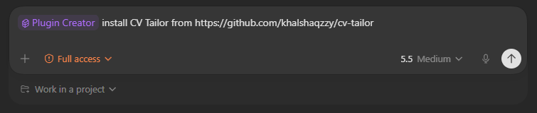
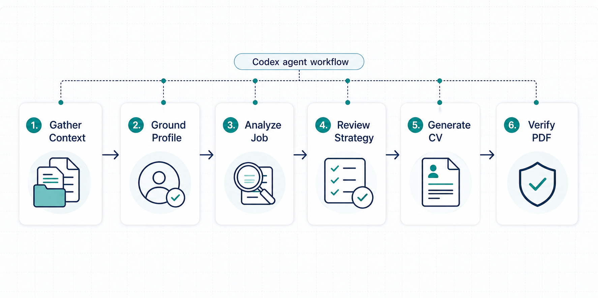

# CV Tailor

<p align="center">
  
</p>

<p align="center">
  <strong>Codex plugin for source-grounded, ATS-safe CV tailoring.</strong><br>
  Turn a real candidate profile and a real job description into a reviewed,
  evidence-backed PDF resume.
</p>

<p align="center">
  
  = 18">
  
  
</p>

## What Is This

CV Tailor is a root-level Codex plugin that helps Codex create tailored resumes
without inventing candidate experience.

Instead of asking an agent to "make my CV fit this job" and hoping it stays
truthful, CV Tailor gives Codex a workflow and tooling for:

- **Profile grounding** from CVs, GitHub/project repos, LinkedIn/profile text,
  portfolios, awards, publications, and user notes.
- **Source-backed claims** where every meaningful bullet or competency points
  to one or more registered evidence sources.
- **Job evaluation** using a structured A-G report: role summary, CV match,
  positioning strategy, company context, personalization plan, story bank hooks,
  and posting legitimacy.
- **Human-in-the-loop tailoring** before final PDF generation.
- **ATS-safe PDF generation** with a single-column HTML template, self-hosted
  fonts, Unicode normalization, and Playwright rendering.
- **Runtime isolation** so private user data lives in the user's workspace,
  never in this plugin repository.

> Important: CV Tailor is not a job-spam tool. It does not submit applications,
> does not fabricate missing experience, and should not be used to misrepresent
> a candidate. It helps make real evidence legible for a specific role.

## Features

| Feature | Description |
| --- | --- |
| Codex Skill | `cv-tailor` routes setup, profile grounding, evaluation, PDF rendering, story-bank work, and verification. |
| Source Registry | Durable evidence index in `.cv-tailor/source-registry.json`, with helper script for adding file-backed sources. |
| Claim Validation | Tailored CV JSON is checked for approved generation and valid `sourceIds`. Unsupported claims fail validation. |
| A-G Evaluation | Report structure adapted from Career Ops: role summary through posting legitimacy and human review choices. |
| Story Bank | STAR+R story-bank template for reusable interview and resume proof points. |
| ATS PDF | Choose HTML-to-PDF rendering via Playwright or LaTeX-to-PDF rendering via bundled Tectonic on Windows. |
| Keyword Coverage | Checks tailored CV content against a job dossier or keyword list. |
| Liveness Check | Playwright-based job URL active/expired classifier for posting legitimacy workflows. |
| Run Manifests | Captures generated artifacts, approval state, job metadata, and PDF verification. |
| Regression Suite | `npm run test-all` validates schemas, examples, runtime init, source ingestion, HTML/LaTeX PDF rendering, liveness, and hygiene. |

## Quick Start

If you are already using Codex with the Plugin Creator flow, you can ask Codex
to install the plugin directly from GitHub:

<p align="center">
  
</p>

The command-line path below is the explicit local install flow. Use it when you
want to clone the plugin yourself, install dependencies, register it in your
local Codex marketplace, and verify that Codex can discover it.

Windows PowerShell:

```powershell
git clone https://github.com/khalshaqzzy/cv-tailor "$HOME\plugins\cv-tailor"
Set-Location "$HOME\plugins\cv-tailor"
npm run setup
npm run install:codex
npm run doctor -- --codex
```

macOS/Linux:

```bash
git clone https://github.com/khalshaqzzy/cv-tailor "$HOME/plugins/cv-tailor"
cd "$HOME/plugins/cv-tailor"
npm run setup
npm run install:codex
npm run doctor -- --codex
```

After installing the plugin in Codex, ask:

```text
Use cv-tailor to tailor my CV for this job description.
```

or:

```text
Use cv-tailor profile to ground my profile from this CV and these GitHub repos.
```

## Install As A Codex Plugin

This repository is the plugin root, but Codex discovery is a separate step.
There are two workflows:

| Workflow | Use when |
| --- | --- |
| **Install in Codex** | You want Codex to list and run `cv-tailor` as a local plugin. |
| **Develop the plugin** | You are editing scripts, schemas, templates, examples, or the skill. |

The plugin manifest is:

```text
.codex-plugin/plugin.json
```

The plugin exposes:

```text
skills/cv-tailor/SKILL.md
```

### Option A: Scripted Local Install

From the plugin root:

```bash
npm run setup
npm run install:codex
npm run doctor -- --codex
```

`npm run install:codex` is idempotent. It installs or verifies
`<home>/plugins/cv-tailor`, updates `<home>/.agents/plugins/marketplace.json`,
and enables `[plugins."cv-tailor@local"]` in `<home>/.codex/config.toml`.

Use `--skip-config` if you want to update Codex config manually:

```bash
npm run install:codex -- --skip-config
```

### Option B: Manual Local Install

Create or update `<home>/.agents/plugins/marketplace.json`:

```json
{
  "name": "local",
  "interface": {
    "displayName": "Local Plugins"
  },
  "plugins": [
    {
      "name": "cv-tailor",
      "source": {
        "source": "local",
        "path": "./plugins/cv-tailor"
      },
      "policy": {
        "installation": "AVAILABLE",
        "authentication": "ON_INSTALL"
      },
      "category": "Productivity"
    }
  ]
}
```

Create or update `<home>/.codex/config.toml`:

```toml
[marketplaces.local]
last_updated = "2026-01-01T00:00:00Z"
source_type = "local"
source = '<home>'

[plugins."cv-tailor@local"]
enabled = true
```

Then run:

```bash
npm run doctor -- --codex
```

Restart Codex or open a new thread so the plugin list refreshes.

Full install details are in [docs/install-codex-local.md](docs/install-codex-local.md).

### Develop The Plugin

For development, clone anywhere and run:

```bash
npm install
npx playwright install chromium
npm run test-all
```

This validates the repo without requiring Codex local marketplace registration.

## Runtime Data

User-specific data is stored in the active workspace under `.cv-tailor/`.
Plugin source files stay generic and installable.

```text
.cv-tailor/
  profile.yml              # Candidate identity, targets, constraints, preferences
  source-registry.json     # Source-backed evidence index
  story-bank.md            # Reusable STAR+R stories
  sources/                 # Private CVs, exports, notes, project evidence
  reports/                 # Evaluation reports
  output/                  # Generated PDFs
  runs/                    # Per-job tailored CV JSON, HTML, manifests
```

The runtime folder includes its own `.gitignore` so local private material is
not accidentally committed.

## Usage

The `cv-tailor` skill supports these modes:

| User intent | Mode |
| --- | --- |
| Set up runtime files | `cv-tailor init` |
| Add or update candidate context | `cv-tailor profile` |
| Evaluate a job without final PDF | `cv-tailor evaluate` |
| Render an approved tailored CV | `cv-tailor pdf` |
| Review or update proof stories | `cv-tailor story-bank` |
| Validate plugin/runtime health | `cv-tailor verify` |
| Paste a JD or job URL | Full tailor pipeline |

Suggested prompts:

```text
Use cv-tailor to initialize this workspace.
Use cv-tailor profile. I am pasting my current CV and project notes.
Use cv-tailor evaluate for this job URL.
Use cv-tailor to generate an ATS PDF after I approve the tailoring plan.
Use cv-tailor story-bank to turn these achievements into STAR+R stories.
```

## How It Works

<p align="center">
  
</p>

CV Tailor gives Codex a constrained workflow instead of a loose resume-writing
prompt. The agent gathers user-provided context, grounds the candidate profile
in registered evidence, analyzes the target role, pauses for human strategy
review, generates structured CV content, and verifies the final PDF artifacts.

The six stages are:

1. **Gather Context** - Collect CVs, profile exports, project repos, portfolio
   links, awards, publications, job descriptions, and user constraints.
2. **Ground Profile** - Normalize candidate facts into `.cv-tailor/profile.yml`,
   `.cv-tailor/source-registry.json`, and the reusable story bank.
3. **Analyze Job** - Extract requirements, ATS terms, risks, seniority signals,
   company context, and evidence gaps.
4. **Review Strategy** - Ask the user to approve positioning, section priority,
   project selection, gap framing, and PDF format before final generation.
5. **Generate CV** - Produce `tailored-cv.json` with every meaningful bullet,
   competency, and project tied to known `sourceIds`.
6. **Verify PDF** - Validate source references, render ATS-safe HTML or LaTeX/PDF, check
   artifacts, and write a run manifest for traceability.

## Source-Backed Claim Model

The core rule is simple: if the final CV says it, there must be evidence for it.

Each meaningful claim in `tailored-cv.json` includes `sourceIds`:

```json
{
  "text": "Reduced model deployment time from 2 weeks to 4 hours with CI/CD paths for tested model releases.",
  "sourceIds": ["cv-current"]
}
```

Competencies are source-backed too:

```json
{
  "text": "LLM evaluation",
  "sourceIds": ["project-eval-toolkit"]
}
```

Unsupported sources fail validation:

```bash
npm run validate-tailored-cv -- \
  examples/unsupported-claim.example.json \
  --source-registry examples/source-registry.example.json
```

## Full Tailor Pipeline

The full workflow is intentionally conservative:

1. **Preflight** - Check plugin install, dependencies, browser, and workspace.
2. **Context gathering** - Ask only for missing CV/profile/project/JD context.
3. **Profile grounding** - Build the evidence map from profile and registry.
4. **Job extraction** - Read a pasted JD or browser-render a public job URL.
5. **Evaluation** - Create an A-G report with match, gaps, strategy, and ATS keywords.
6. **Human review** - Ask the user to approve positioning, project selection, gap framing, and PDF settings.
7. **Tailored CV JSON** - Produce structured CV content with `sourceIds`.
8. **Validation and rendering** - Validate claims, ask for HTML or LaTeX renderer, create PDF, write manifest.

## Script Reference

| Command | Purpose |
| --- | --- |
| `npm run setup` | Install npm dependencies, install Playwright Chromium, and run `doctor`. |
| `npm run install:codex` | Install/register the plugin in the local Codex marketplace. |
| `npm run doctor` | Validate plugin prerequisites. Add `-- --workspace <path>` to check runtime files or `-- --codex` to check Codex discovery. |
| `npm run init -- --workspace <path>` | Create `.cv-tailor/` runtime structure. |
| `npm run add-source -- ...` | Copy a source file into `.cv-tailor/sources/` and register its facts. |
| `npm run validate-tailored-cv -- <json>` | Validate tailored CV shape, approval, and source references. |
| `npm run render-html -- <json> <html>` | Render a tailored CV JSON file to ATS-safe HTML. |
| `npm run render-pdf -- <html> <pdf> --format=a4` | Render HTML to PDF using Playwright. |
| `npm run render-latex -- <json> <tex>` | Render a tailored CV JSON file to the bundled LaTeX resume template. |
| `npm run compile-latex -- <tex> <pdf>` | Compile LaTeX to PDF with bundled Tectonic on Windows. |
| `npm run render-cv -- <json> <pdf> --engine=html\|latex` | Render a final PDF through the selected engine. |
| `npm run ats-keyword-check -- <json> --job-dossier <job.json>` | Measure keyword coverage against a job dossier. |
| `npm run check-liveness -- <url>` | Check whether a public job URL appears active, expired, or uncertain. |
| `npm run write-run-manifest -- ...` | Record generated artifacts and approval state. |
| `npm run verify` | Validate plugin files and examples. |
| `npm run test-all` | Run the full regression suite. |

## Examples

The `examples/` directory contains fixtures adapted from the Career Ops style:

| File | Purpose |
| --- | --- |
| `examples/cv-example.md` | Example candidate CV source. |
| `examples/source-registry.example.json` | Evidence registry for the example CV/project. |
| `examples/job-dossier.example.json` | Example job dossier and ATS keywords. |
| `examples/evaluation-report.example.md` | Example A-G evaluation report. |
| `examples/tailored-cv.example.json` | Valid source-backed tailored CV fixture. |
| `examples/tailored-cv.latex.example.json` | Valid LaTeX-capable tailored CV fixture. |
| `examples/unsupported-claim.example.json` | Negative fixture that should fail validation. |
| `examples/run-manifest.example.json` | Example run manifest. |
| `examples/codex-marketplace.local.example.json` | Local Codex marketplace registration example. |
| `examples/codex-config.local.example.toml` | Local Codex config snippet for enabling the plugin. |
| `examples/install/` | Expected install fixtures used by local install verification. |

Try the example pipeline:

```bash
npm run validate-tailored-cv -- \
  examples/tailored-cv.example.json \
  --source-registry examples/source-registry.example.json

npm run render-html -- \
  examples/tailored-cv.example.json \
  /tmp/cv-tailor-example.html

npm run render-pdf -- \
  /tmp/cv-tailor-example.html \
  /tmp/cv-tailor-example.pdf \
  --format=a4

npm run render-cv -- \
  examples/tailored-cv.latex.example.json \
  /tmp/cv-tailor-example-latex.pdf \
  --engine=latex

npm run ats-keyword-check -- \
  examples/tailored-cv.example.json \
  --job-dossier examples/job-dossier.example.json \
  --min 0.5
```

On Windows PowerShell, replace `/tmp/...` with a local path such as
`$env:TEMP\cv-tailor-example.html`.

## Project Structure

```text
cv-tailor/
  .codex-plugin/
    plugin.json
  skills/
    cv-tailor/
      SKILL.md
  scripts/
    add-source.mjs
    ats-keyword-check.mjs
    check-liveness.mjs
    doctor.mjs
    install-codex-local.mjs
    init.mjs
    render-html.mjs
    render-latex.mjs
    render-pdf.mjs
    render-cv.mjs
    compile-latex.mjs
    tectonic-path.mjs
    test-all.mjs
    validate-tailored-cv.mjs
    verify.mjs
    write-run-manifest.mjs
    lib/
      workspace.mjs
  schemas/
    profile.schema.json
    source-registry.schema.json
    job-dossier.schema.json
    tailored-cv.schema.json
    run-manifest.schema.json
  templates/
    cv-template.html
    cv-template.tex
    profile.example.yml
    source-registry.example.json
    story-bank.template.md
  examples/
  docs/
  bin/
    tectonic.exe
  fonts/
  assets/
```

## Data Contract

CV Tailor follows the same separation principle as Career Ops:

| Layer | Files | Rule |
| --- | --- | --- |
| Plugin/system layer | `skills/`, `scripts/`, `schemas/`, `templates/`, `examples/`, `fonts/`, `assets/` | Safe to version and update. No private user data. |
| User/runtime layer | `.cv-tailor/profile.yml`, `.cv-tailor/source-registry.json`, `.cv-tailor/sources/`, `.cv-tailor/reports/`, `.cv-tailor/output/`, `.cv-tailor/runs/` | Private workspace data. Do not commit by default. |

## PDF Rendering

CV Tailor supports two final rendering paths. The user should choose one during
the human review gate before final PDF generation.

| Renderer | Best for | Command |
| --- | --- | --- |
| `html` | Existing Playwright flow, web-style template, A4/Letter browser PDF output. | `npm run render-cv -- <json> <pdf> --engine=html --format=a4` |
| `latex` | Compact engineering resume style matching the bundled LaTeX template. | `npm run render-cv -- <json> <pdf> --engine=latex` |

The HTML template is intentionally plain and parser-friendly:

- Single-column layout.
- Standard section names.
- Selectable text, not rasterized content.
- No critical information in images.
- Space Grotesk headings and DM Sans body text.
- Self-hosted `.woff2` fonts.
- ASCII-safe normalization for smart quotes, dashes, zero-width characters, and non-breaking spaces.
- A4 or Letter output through Playwright.

The LaTeX template preserves the supplied resume structure:

- Education, Work Experience, Projects, Leadership, Technical Skills.
- Compact bullets, dense technical phrasing, and `\textbf{}` emphasis for technologies, metrics, and outcomes.
- Empty sections are skipped instead of rendered with placeholders.
- Windows Tectonic `0.16.9` is bundled under `bin/tectonic.exe`.
- No system TeX installation or external Codex LaTeX plugin is required for the
  Windows LaTeX path.

See [docs/latex-rendering.md](docs/latex-rendering.md) for compiler details and
troubleshooting.

## Human-In-The-Loop Rules

Codex can draft reports, evidence matrices, and tailored CV JSON. It should stop
for user approval before final PDF generation when the CV changes:

- headline or seniority positioning
- selected projects
- experience bullet order or wording
- awards, publications, certifications, or credentials
- gap framing
- page format or length target
- final renderer: HTML/Playwright or LaTeX/Tectonic

Even if the user asks to generate without review, unsupported or ambiguous
claims must be resolved before rendering the final PDF.

## Privacy And Ethics

CV Tailor is local software. It does not host, collect, or store your data
outside your machine. Your data may still be sent to whatever AI provider or
Codex environment you choose to use.

Use it responsibly:

- Do not invent experience, metrics, education, employers, credentials, awards,
  or publications.
- Do not scrape private LinkedIn pages or authenticated job systems without
  user-visible consent.
- Do not submit applications automatically.
- Review every generated CV before using it.
- Respect job board and employer terms of service.

See [docs/privacy.md](docs/privacy.md), [docs/terms.md](docs/terms.md), and
[docs/security.md](docs/security.md) for the marketplace-facing policy docs.

## Testing

Run the complete test suite before committing changes:

```bash
npm run test-all
```

The suite checks:

- script syntax
- plugin verification
- JSON schemas and examples
- valid and invalid source-backed CV fixtures
- runtime workspace initialization
- source ingestion
- HTML and PDF rendering
- LaTeX rendering and bundled Tectonic compilation
- run manifest writing
- ATS keyword coverage
- liveness classification
- local Codex installer and discovery checks
- repository hygiene

## Roadmap

Useful next improvements:

- More source ingestion helpers for GitHub repos, exported LinkedIn PDFs, and
  portfolio pages.
- A deterministic job-dossier builder from pasted JD text.
- Better rendered-PDF layout inspection.
- Optional cover letter generation using the same source-backed claim model.
- Multilingual mode references for non-English CVs and job descriptions.

## Attribution

CV Tailor adapts selected MIT-licensed workflow ideas from
[Career Ops](https://github.com/santifer/career-ops), especially the
human-in-the-loop career workflow, A-G evaluation structure, story-bank concept,
ATS PDF strategy, and Playwright-based rendering approach.

## License

MIT
